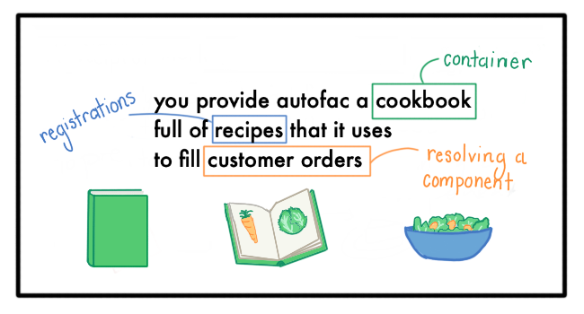
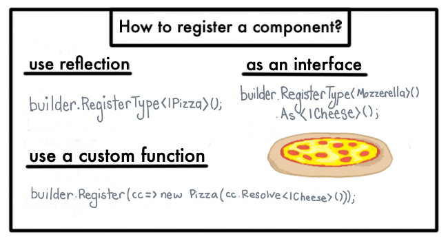
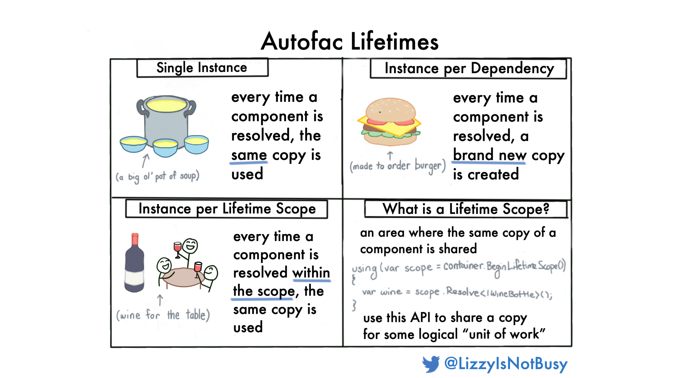
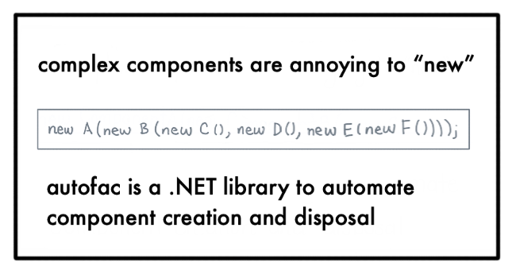

[Autofac](https://autofac.org/) is a popular .NET "[inversion of control](https://martinfowler.com/articles/injection.html)" library.

(include?)
Designed to be lightweight and unobtrusive, Autofac fades into the background of a large project. 

This article is meant for those of you that have used Autofac for weeks, months, or years without really understanding the *why* behind "inversion of control" or what Autofac is doing to you.

Let's zoom way out, away from the APIs or setup details, to a metaphor -- Autofac as a restaurant.

# Café Autofac

(include picture)

## Why do restaurants exist?
Most of us have kitchens and access to grocery stores. And thanks to online recipes -- the know-how to make a million different dishes. 

So why do restaurants exist? Because cooking high-quality meals requires effort and precision. 

**Effort.** Cooking takes time, and although you can grow more efficient over time, it is more efficient.

**Precision.** Any recipe longer than 5 steps, and I am bound to mismeasure something or my perpetually too-cold oven will add in some guesswork.

Now imagine that you want to have a special dinner -- say, Beef Wellington (est. 6 hours). This could be enjoyable, but it is worth outsourcing it to another party

## Why does Autofac exist?

For the same reason, as the existence of restaurants.

To understand why "inversion of control" is useful technology, it is instructive to imagine what development would be like without it.

Classes would need to "new up" their dependencies every time they want to use something. If a class wanted to cache a value, it would need pass that cache instance to every other person who wanted to use it.

Dependency management takes effort and precision. 

**Effort.** You have to "new up" all your dependencies which takes forever and makes you really think twice before adding a new dependency.

**Precision.** As your application gets more complicated, you will find yourself need to reuse components for caches or having to worry about memory leaks and proper disposal.

```cs
// without Autofac / IOC
public class MyMeal()
{
    public MyMeal()
    {
        new BeefWellington(
            new Steak { Doneness = Doneness.MediumRare },
            // Pâté is expensive! Reuse it if we can.
            pateLeftOverFromLastWeek,
            // Duxelles has so many ingredients :(
            new Duxelles(
                new ChoppedMushrooms(),
                new Onions { Chopped = true }),
                ...
    }
}
```
```cs
// with Autofac! So nice!
public class MyMeal()
{
    public MyMeal(BeefWellington beefWellington) // dependency injection!
    {
        beefWellington.Enjoy();
    }
}
```

## Autofac vocabulary

To make the metaphor work we need to define some terms

> You provide Autofac a cookbook full of recipes that it uses to fill customer orders.

**Customer orders.** As your application runs, you need to "resolve" components from the container to use them. In the metaphor, these are customer orders.

**Recipes.** These are the registrations given 

**Cookbook.** This is the Autofac **container**. Just like a cookbook, the 


Here's how the cafe works --

> you provide Autofac a cookbook full of recipes that it uses to fill customer orders



EXPLAIN CONTAINER - THAT IT IS CREATED WHEN THE APP IS.

The cookbook is your contiainer -- all set up before mealtime and used for the duration of meal (i.e. the application lifetime). Your recipes are your registrations which are specific to the exact way you want the service created. And all of this is in service of your customer orders -- i.e. a service wanting to use another service.

## Vocabulary

Now that we have motivated *why* Autofac

## What types of registrations are there?
There are different ways you can specify your recipes. 



**As interface.** Ordering coffee for dessert vs. at a coffee shop. Sometimes you just want "coffee" and othertimes you want a specific type.

And if you want to bundle a bunch of recipes together, you can use "modules".


##### What are lifetimes
This is an important concept and one of the trickiest to wrap your head around.

There are three types of lifetimes:
- Single instance
- Instance per Dependency
- Instance per Lifetime Scope

Single instance means that you want the exact same instance of the component every time. This is useful if you are caching something inside that component. Think of this like a pot of soup, the soup is made in a big batch at the beginnning of the evening and then every customer is served from the same batch all night. The soup is only cooked once.

**Instance per Dependency.** Every time you resolve the component, you would like a new instance of it. This is the default registration and good to use if all your components are stateless / easy. This is like a made-to-order burger. It is not made ahead of time, only when you order it.

**Instance per Lifetime Scope.** Every time you resolve the component within the same lifetime, you would like the same instance. This is a custom API that you can use if you need to scope something in a custom way, i.e. an HTTP request. I have used this to pass an object for logging that different components could log to. This is like a bottle of wine for the table. A new one is served to each table that orders a bottle of wine, but the same bottle is shared for the whole tale.



Thanks for reading, and visit the official documentation for more details!

(
Venn diagram of Autofac + restaurant
- handles making the complicated stuff, etc.
)

Restaurants exist because we sometimes don't want to cook our own food, we'd rather outsource that to someone who understands exactly how to make the dish.

Though this is delightful day-to-day, it means that developers working in an Autofac codebase don't have a lot of practical experience with the library since it "just works".

This blog post is my stab at explaining why we use Autofac and a variety of features that you may not know about.

This blog post is an attempt to explain Autofac conceptually. The documentation is great, it can explain to you how to actually use the library, this post is written to motivate why you want to use Autofac and the general principals at play.


