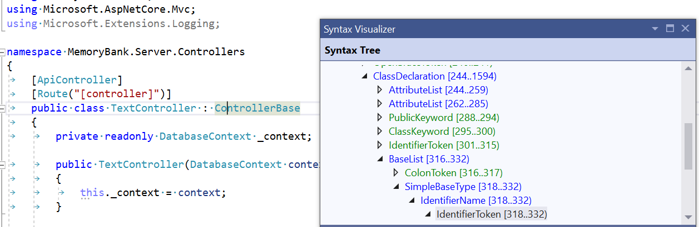
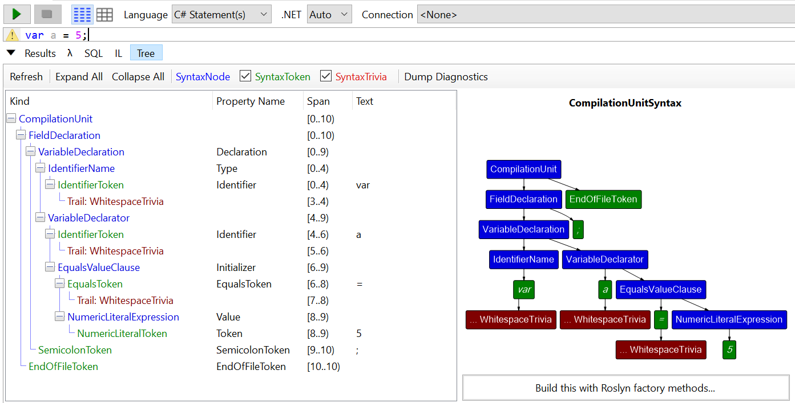

Last year, I gave a talk ([link](https://www.youtube.com/watch?v=C-2haqb60No)) at [.NET Conf](https://www.dotnetconf.net/) about how my teammates and I automated the migration of 200 applications to .NET Core. At the core of our strategy were a handful of LINQPad scripts that leveraged Roslyn to refactor C# code.

Some in attendance were curious about the specifics this refactoring, e.g. what APIs we used, how to get started writing a refactoring script. This post is my belated answer to those questions!

This post is not an attempt to exhaustively document the Roslyn APIs. It will attempt to do the opposite. Roslyn has a reputation for being complex and difficult because it has such a wide API surface area. The goal of this post is to share the minimum set of APIs that will provide a basis for writing a practical refactoring script of your own.


# What is Roslyn?
Roslyn is the friendly name of the C# compiler (named after [Roslyn, Washington](https://en.wikipedia.org/wiki/Roslyn,_Washington)). In addition to the typical duties of a compiler, the Roslyn compiler has an API surface for consumers to directly interact with. For example, a consumer can use the Syntax API to parse C#/F#/VB code into the syntrax tree representation that the compiler uses during compilation.

Released in 2011 and open-sourced in 2014, Roslyn (and its consumer APIs) has received a lot of attention from the .NET team. It is incredibly powerful and a delight to use.

# Setup

NOTE: Roslyn has two API surfaces for examining and modifying code: the [Syntax API](https://docs.microsoft.com/en-us/dotnet/csharp/roslyn-sdk/work-with-syntax) and the [Semantic API](https://docs.microsoft.com/en-us/dotnet/csharp/roslyn-sdk/work-with-semantics). The examples in this blog post will all use the Syntax API because I only use the Syntax API, since I have found it is (1) always simpler to setup (2) usually powerful enough for the task at hand.

## Step 0: Determine your scripting environment

An underrated developer skill is the ability to [setup up a minimum environment for any task]("https://lizzy-gallagher.github.io/using-underdocumented-features/#take-it-for-a-test-drive"). Given the complexity of the API and the "use once" nature of refactoring scripts, you will need an environment that you can quickly iterate within.

My first choice for a scripting is always [LINQPad](https://www.linqpad.net/) because its debugger is a pure delight (aside: your first time using `.Dump()` will forever ruin your contentment with Visual Studio's `Watch` tab). LINQPad's main drawback its only tenous support for [non-Windows machines](https://forum.linqpad.net/discussion/comment/5720/#Comment_5720).

My second choice (or first choice if I need unit tests), is to set up a bare-bones .NET 5 console project using the Visual Studio template.

## Step 1: Install "Roslyn"

Install the NuGet package [Microsoft.CodeAnalysis](https://www.nuget.org/packages/Microsoft.CodeAnalysis).

## Step 2: Drop in methods for I/O
 
At the beginning of your script, you'll need to create a syntax tree from a file. At the end, you'll need to write your transformed syntax tree back to that file.

```c#
var content = File.ReadAllText(pathToMyCSharpFile);
var editor = CreateEditor(content);

// ... make changes using editor ...

var changedRoot = editor.GetChangedRoot();
var updatedContent = this.FormatChanges(changedRoot);
File.WriteAllText(pathToMyCSharpFile);
```

Here are the exact implementations we use:
```c#
// string -> syntax tree
private SyntaxEditor CreateEditor(string content)
{
    var syntaxRoot = SyntaxFactory.ParseCompilationUnit(content);
    return new SyntaxEditor(syntaxRoot, new AdhocWorkspace());
}

// syntax tree -> string
private string FormatChanges(SyntaxNode node)
{
    var workspace = new AdhocWorkspace();
    var options = workspace.Options
        // change these values to fit your environment / preferences 
        .WithChangedOption(FormattingOptions.UseTabs, LanguageNames.CSharp, value: true)
        .WithChangedOption(FormattingOptions.NewLine, LanguageNames.CSharp, value: "\r\n");
    return Formatter.Format(node, workspace, options).ToFullString();
}
```

## Step 3: Drop in a method to reduce contention
The Roslyn Syntax API parses C# into a tree of nodes: class nodes, method nodes, even semicolon nodes!

A byproduct of this design is that when a node is deleted or replaced, all of its child nodes (e.g. all the statement nodes inside of a method node) will disappear from the updated tree. As you can imagine, this can cause a lot of headaches if you attempt to make an update based on data from a stale representation of the tree.

Although many of headaches can be avoided by replacing only the narrowest set of nodes, we found that swapping in our own API for `ReplaceNode` that required update functions instead of blindly accepting new nodes led to less contention and fewer exceptions.

```c#
static void ReplaceNode<TNode>(
    SyntaxEditor editor, 
    TNode node, 
    Func<TNode, SyntaxNode> computeReplacement) 
    where TNode : SyntaxNode =>
    editor.ReplaceNode(node, (n, _) => computeReplacement((TNode)n));
```

# Start refactoring!
The structure of a refactor has two parts:
1. Identify the narrowest set of nodes to be updated
2. Update!

Here are two real refactors from our conversion script from ASP.NET to ASP.NET Core:
```c#
//
// The ASP.NET way of accessing a query no longer works on ASP.NET Core
//
// OLD: this.Request.Url.Query
// NEW: this.Request.QueryString.Value
//
void ReplaceUsagesOfQueryString(SyntaxEditor editor)
{
    // (1) identify the narrowest set of nodes to be updated
    editor.OriginalRoot
        .DescendantNodes()
        .OfType<MemberAccessExpressionSyntax>()
        .Where(s => s.ToString() == "this.Request.Url.Query"))
        .ToList()
        // (2) update!
        .ForEach(s => {
             ReplaceNode(
                 editor, 
                 usage,
                 // SyntaxFactory is a static class used for creating new nodes
                 node => SyntaxFactory
                    // ParseExpression is the most powerful API in SyntaxFactory.
                    // Here, instead of creating 3 nested MemberAccessExpressionSyntaxes,
                    // ParseExpression does the heavy lifting.
                    .ParseExpression("this.Request.QueryString.Value"))
        });
}
```
> AG: may want to qualify what _transitioning_ is
```c#
//
// Although many attributes have a direct parallel from ASP.NET MVC or Web Api and ASP.NET Core,
// they will not be "transitioned" if they are fully qualified and lead to confusing runtime errors.
//
// OLD: [System.Web.Mvc.HttpGet]
// NEW: [HttpGet]
//
void ShortenQualifiedAttributeNames(SyntaxEditor editor)
{
    // (1) identify the narrowest set of nodes to be updated
    var attributes = editor.OriginalRoot
        .DescendantNodes()
        .OfType<AttributeSyntax>();

    // (2) update!
    foreach (var attribute in attributes)
    {
        // syntaxNode.ToString() returns the string representation of
        // the node as it was in the original code (including leading
        // and trailing whitespace)
        var originalName = attribute.Name.ToString();
        var shortenedName = Regex.Replace(originalName, @"^System\.Web\.(Mvc|Http)\.", string.Empty);
        if (originalName != shortenedName)
        {
            ReplaceNode(
                editor, 
                attribute, 
                // .WithX is the syntax API's naming pattern for methods 
                // that replace one node with another. Here we are 
                // replacing one NodeSyntax with another.
                a => a.WithName(SyntaxFactory.ParseName(shortenedName)));
        }
    }
}
```

The surface area of the Syntax API is quite large, and is best discovered through trial and error.

## A note about organization
As your script gets longer, the likelihood of something going wrong -- an exception being thrown, an unexpected pattern -- increases, along with the chance that a .NET solution / project will end up in a limbo state with 50% of the refactors applied.

To defend against unexpected exceptions leaving consumers in limbo, my team adopted the "transaction" design pattern, i.e. all changes would be committed or none would be. This pattern added some boilerplate to our otherwise lightweight scripts, but it saved a lot of mental overhead and enabled us to add exception-throwing features like validation.

Here's the rough outline of "transaction" pattern:

```c#
Action commit = () => { };

// per-solution, non-Roslyn updates
commit += this.UpdateWebConfigs();
commit += this.UpdateNuGetExe();

// per-project, Roslyn updates
commit += () => projects.ForEach(p => UpdateCSFiles(p));

// we only get here if nothing threw an exception!
commit();
```

Let's zoom in on the Roslyn-specific methods: 
```c#
Action UpdateCSFiles(IEnumerable<CSharpProject> projects)
{
    var changes = new List<Action>();

    foreach (var project in projects)
    {
        var csFiles = Directory
            .EnumerateFiles(project.Directory, "*.cs", SearchOption.AllDirectories);
        foreach (var csFile in csFiles)
        {
            if (this.TryUpdateCSCode(File.ReadAllText(csFile), project, out var updatedCode))
            {
                changes.Add(() => File.WriteAllText(csFile, updatedCode, Encoding.UTF8));
            }
        }
    }

    return () => changes.ForEach(a => a.Invoke());
}


bool TryUpdateCSCode(string code, CSharpProject project, out string updatedCode)
{
    var editor = this.CreateEditor(code);

    this.ShortenQualifiedAttributeNames(editor);
    
    // ... more refactoring methods ...
    
    this.ReplaceUsagesOfQueryString(editor);

    // to keep the git diff minimal, only commit the changes
    // if the tree changed  
    var changedRoot = editor.GetChangedRoot();
    if (changedRoot.ToFullString() != code)
    {
        updatedCode = this.FormatChanges(changedRoot);
        return true;
    }

    updatedCode = null;
    return false;
}
```
The details and capabilities of the Roslyn APIs could fill many more blog posts. I am hoping this practical guide to getting started helped you get started. 

Good luck and happy refactoring!


# Appendix: Frequently asked questions
## How can I learn more about the Syntax API's data model?
 
It is important to remember that Roslyn syntax trees have a very specific and narrow type for every node.

Two tools you can use to learn the names of these types are the 

1. **The Visual Studio Syntax Visualizer**. As you click around your code, the tool will focus on the relevant section of the tree.



 2. **LINQPad Tree view**. The tool will create a syntax tree for your entire program.



## When should I automate refactoring?
For the cost-benefit analysis of when automation is worth it, I direct you to this evergreen [XKCD](https://xkcd.com/1205/).

For a longer discussion about the value of codifying how to do a modernization for consumers via scripts, I direct you to my talk at .NET Conf ([link](https://www.youtube.com/watch?v=C-2haqb60No)).

Since that video is 30 minutes long, here is a summary:

> Part of my team's purview is to oversee the health of a web platform with 150 microservices. When we embark on some form of modernization (e.g. .NET Framework to .NET Core), it is always worth it to codify and distribute the change in the form of a well-tested modernization. This is because the microservices (and 100+ console applications) are owned by teams that are experts of their applications, but inexperienced at the specifics of modernization. Instead of requiring all product teams to stumble through the vast list of code changes required for updating, my team automated the changes to streamline the process, something we were uniquely positioned to do as experts of the modernization itself.

Here are a few examples of real-world scripts my team has written and some of the automated steps each required:
- **Updating from NUnit 2 -> NUnit 3.**
    - Recover from the removal of `[ExpectException]` attribute by adding a line to appropriate test cases to assert that the proper exception type was thrown
    - Rename various attributes / APIs, e.g. `[TestFixtureSetUp]` -> `[OneTimeSetUp]`
- **Updating from ASP.NET to ASP.NET Core**
    - Recover from various API changes (all the examples in this blog post)
    - Migrate from Global.asax.cs to Program.cs / Startup.cs
    - Add / remove a **lot** of `PackageReferences`
    - Delete web.configs
    - Move all static content to `wwwroot/` and update `package.json` and `tsconfig.json` accordingly
- **Updating to C#8**
    - Make .csproj changes to enable nullable reference type annotations
    - Based on consumer input -- Use heuristics to add the "easy" nullable reference type annotations (e.g. `MyMethod(string optional = null)` -> `MyMethod(string? optional = null)`) **or** add `#nullable disable`to each file to allow consumers to convert files one-by-one.  
- **Releasing a major version bump of an internal NuGet package**
    - Recover from our own API changes / renames!